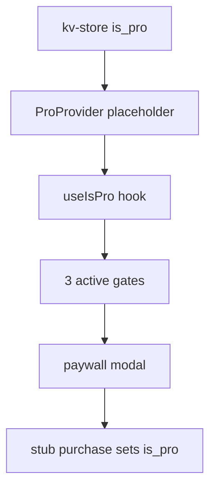

# Wants — Monetization Placeholder (local `is_pro`)

Last updated: 2026-06-24

Implementation checklist for monetization **UI and gating logic** before an Apple Developer account or live RevenueCat purchases. For RevenueCat / App Store integration, see [PAYMENTS_SETUP.md](PAYMENTS_SETUP.md). For high-level done/not-done, see [IMPLEMENTATION_STATUS.md](IMPLEMENTATION_STATUS.md).

Tick off phases as you complete them across sessions.

---

## Goal & scope

Build paywall UI (PRD S13), Account screen (S12), and **three active enforcement gates** (Home FAB + add guard, Past tab cap, theme settings — theme already done). Drive pro state from kv-store `is_pro` via a `ProProvider` placeholder (future swap target for `PurchasesProvider`).

v1 stores `is_pro` in **kv-store** (`IS_PRO_KEY`), not a Drizzle settings table — this matches PRD §3 conceptual “settings” prefs.

---

## Explicitly out of scope

- RevenueCat `Purchases.configure`, real offerings, StoreKit sandbox
- **Custom delay** — no Custom picker option; no pro custom input (deferred; paywall may still list custom delays as a Pro benefit)
- iOS 64-notification prioritization for unlimited waiting items (Pro)

---

## Architecture

PRD §8 defines **four** enforcement surfaces. Placeholder implements three; custom delay (gate 2) is deferred — see Phase P4.

---

## Already in repo

- [x] `IS_PRO_KEY` in `src/constants/storage-keys.ts`
- [x] `readIsPro()` / `useIsPro()` in `src/hooks/use-is-pro.ts` (reads kv-store directly today)
- [x] Paywall route `src/app/paywall.tsx` (shell placeholder)
- [x] Modal registration in `src/app/_layout.tsx`
- [x] `pushPaywallRoute()` in `src/lib/push-paywall-route.ts`
- [x] Theme settings pro gate in `src/app/settings/theme.tsx` (gate 4)

---

## Phase P1 — Pro state layer

- [ ] **`src/lib/pro-status.ts`** — `readIsPro()`, `writeIsPro(value: boolean)` using kv-store
- [ ] **`src/contexts/pro-context.tsx`** — placeholder for future `PurchasesProvider`:
  - Seed `isPro` synchronously from kv-store on init (avoid free-tier flash on cold start)
  - Expose `{ isPro, loading, purchasePlaceholder, restorePlaceholder, refresh }`
  - `loading` is always `false` in placeholder
  - `purchasePlaceholder()` — sets `is_pro` true, updates context
  - `restorePlaceholder()` — re-read kv-store or show “nothing to restore” alert
- [ ] **Update `src/hooks/use-is-pro.ts`** — read from `ProProvider` context (not kv-store directly)
- [ ] **Mount `ProProvider`** in `src/db/migrations.tsx` inside `AppReadyWithOnboarding`, beside `SettingsProvider`

---

## Phase P2 — Paywall UI (PRD S13)

**File:** `src/app/paywall.tsx`

- [ ] Headline: “Unlock the full Wants experience”
- [ ] **Four** benefit bullets: unlimited items · custom delays · full history · premium color themes
- [ ] Two plan cards: Monthly / Annual (annual highlighted)
- [ ] **`src/lib/paywall-placeholder-offerings.ts`** — typed stub prices (single swap point for RevenueCat later; do not scatter prices in UI)
- [ ] Primary CTA: “Start free 7-day trial” (placeholder copy until RC trial metadata)
- [ ] “Restore purchase” → `restorePlaceholder()`
- [ ] “Maybe later” → dismiss modal
- [ ] CTA → `purchasePlaceholder()` → dismiss on success

---

## Phase P3 — Account screen (PRD S12)

**File:** `src/app/settings/account.tsx`

- [ ] If `!isPro`: “Upgrade to Pro” → `pushPaywallRoute()`
- [ ] If `isPro`: subscription status (e.g. “Wants Pro — active”)
- [ ] Always: “Restore purchases” → `restorePlaceholder()` with result alert

---

## Phase P4 — Enforcement gates

PRD §8 enforcement surfaces (four total):

| Gate | Surface | Placeholder status |
|------|---------|-------------------|
| 1 | Home FAB + add route | **Build in placeholder** |
| 2 | Custom delay | **Deferred** — link to [PAYMENTS_SETUP.md](PAYMENTS_SETUP.md) Phase 5 when UX is decided |
| 3 | Past tab 30-day cap | **Build in placeholder** |
| 4 | Theme settings | **Done** — verify after ProProvider |

### Gate 1 — Home FAB + add guard

- [ ] **`src/app/home.tsx`** — when `!isPro && waitingItems.length >= 1`: FAB shows lock icon; `onPress` → paywall (not `/add-want`)
- [ ] **`src/app/add-want.tsx`** — on mount/focus: if gated, open paywall and leave route (blocks deep links)

### Gate 2 — Custom delay (deferred)

No work in placeholder. Future: non-pro Custom → paywall; pro custom input TBD.

### Gate 3 — Past tab 30-day cap

- [ ] **`src/db/queries/items.ts`** — `selectPastItemsSince(since: Date)` or client-side filter
- [ ] **`src/app/all-wants.tsx`** — non-pro: last 30 days only; “Unlock full history” row → paywall when older items exist; pro: all-time

### Gate 4 — Theme settings

- [x] Implemented in `src/app/settings/theme.tsx`
- [ ] Re-verify reactive `isPro` updates after ProProvider (toggle pro without restart)

---

## Phase P5 — Shared helpers & dev tooling

- [ ] **`src/lib/is-add-want-gated.ts`** — `isAddWantGated(isPro, waitingCount)` → `!isPro && waitingCount >= 1`
- [ ] **Dev-only “Toggle Pro”** on Home — mirror `!isProduction` pattern in `src/app/home.tsx` (existing “Reset onboarding” footer)

---

## Phase P6 — Manual test checklist

- [ ] Fresh install: `is_pro` false, one waiting item → FAB locked
- [ ] Paywall CTA → pro → FAB unlocked, can add second item
- [ ] Navigate to `/add-want` while gated → paywall, cannot stay on add
- [ ] Past tab: 30 days only as free; full history as pro; upsell when capped
- [ ] Premium theme locked as free; unlocked as pro
- [ ] Account: upgrade, restore, pro status
- [ ] Kill app → pro state persists in kv-store
- [ ] Dev toggle: flip pro without paywall

---

## Swap points (placeholder → RevenueCat)

| Placeholder | Replace with (PAYMENTS_SETUP) |
|-------------|-------------------------------|
| `ProProvider` | `PurchasesProvider` + `src/lib/purchases.ts` (Phase 3) |
| `paywall-placeholder-offerings.ts` | `Purchases.getOfferings()` / context `offerings` (Phase 4) |
| `purchasePlaceholder()` | `purchasePackage()` + customer-info listener (Phase 3–4) |
| `restorePlaceholder()` | `restorePurchases()` (Phase 3–6) |
| Dev “Toggle Pro” | Keep for internal testing only |

---

## Next step after placeholder

1. Complete UI/gates in this doc (Phases P1–P5).
2. Follow [PAYMENTS_SETUP.md](PAYMENTS_SETUP.md) **Phase 0a** — RevenueCat Test Store (`test_` key, no Apple account required).
3. When ready for real IAP: **Phase 0b** (Apple Developer) and onward.
