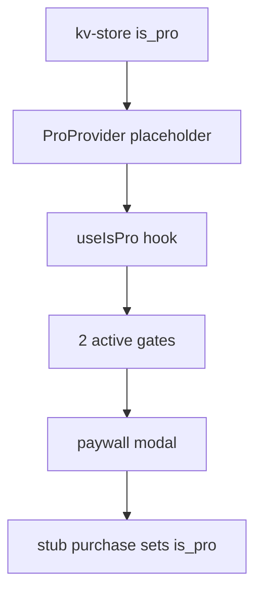

# Wants — Monetization Placeholder (local `is_pro`)

Last updated: 2026-06-24

Implementation checklist for monetization **UI and gating logic** before an Apple Developer account or live RevenueCat purchases. For RevenueCat / App Store integration, see [PAYMENTS_SETUP.md](PAYMENTS_SETUP.md). For high-level done/not-done, see [IMPLEMENTATION_STATUS.md](IMPLEMENTATION_STATUS.md).

Tick off phases as you complete them across sessions.

---

## Goal & scope

Build paywall UI (PRD S13), Account screen (S12), and **two active enforcement gates** (Home FAB + add guard, theme settings — theme already done). Drive pro state from kv-store `is_pro` via a `ProProvider` placeholder (future swap target for `PurchasesProvider`).

v1 stores `is_pro` in **kv-store** (`IS_PRO_KEY`), not a Drizzle settings table — this matches PRD §3 conceptual “settings” prefs.

---

## Explicitly out of scope

- RevenueCat `Purchases.configure`, real offerings, StoreKit sandbox

---

## Architecture

PRD §8 defines **two** enforcement surfaces. Placeholder implements both.

---

## Already in repo

- [x] `IS_PRO_KEY` in `src/constants/storage-keys.ts`
- [x] `readIsPro()` / `writeIsPro()` in `src/lib/pro-status.ts`
- [x] `ProProvider` + `usePro()` in `src/contexts/pro-context.tsx` (stub purchase/restore)
- [x] `useIsPro()` in `src/hooks/use-is-pro.ts` (reads from `ProProvider`; re-exports `readIsPro`)
- [x] `ProProvider` mounted in `src/db/migrations.tsx` (wraps `ThemeProvider`)
- [x] Paywall route `src/app/paywall.tsx` (shell placeholder)
- [x] Modal registration in `src/app/_layout.tsx`
- [x] `pushPaywallRoute()` in `src/lib/push-paywall-route.ts`
- [x] Theme settings pro gate in `src/app/settings/theme.tsx` (gate 4)

---

## Phase P1 — Pro state layer

- [x] `**src/lib/pro-status.ts`** — `readIsPro()`, `writeIsPro(value: boolean)` using kv-store
- [x] `**src/contexts/pro-context.tsx**` — placeholder for future `PurchasesProvider`:
  - Seed `isPro` synchronously from kv-store on init (avoid free-tier flash on cold start)
  - Expose `{ isPro, loading, purchasePlaceholder, restorePlaceholder, refresh }`
  - `loading` is always `false` in placeholder
  - `purchasePlaceholder()` — sets `is_pro` true, updates context
  - `restorePlaceholder()` — re-read kv-store or show “nothing to restore” alert
- [x] **Update `src/hooks/use-is-pro.ts`** — read from `ProProvider` context (not kv-store directly)
- [x] **Mount `ProProvider`** in `src/db/migrations.tsx` inside `AppReadyWithOnboarding`, beside `SettingsProvider`

---

## Phase P2 — Paywall UI (PRD S13)

**File:** `src/app/paywall.tsx`

- [x] Headline: “Unlock the full Wants experience”
- [x] **Two** benefit bullets: unlimited items · premium color themes
- [x] Three plan tabs: Monthly / Annual / Lifetime (annual default)
- [x] `**src/lib/paywall-placeholder-offerings.ts`** — typed stub prices (single swap point for RevenueCat later; do not scatter prices in UI)
- [x] Primary CTA: plan-specific (subscribe monthly/annual, lifetime unlock)
- [x] “Restore purchase” → `restorePlaceholder()`
- [x] “Maybe later” → dismiss modal
- [x] CTA → `purchasePlaceholder(planId)` → dismiss on success

---

## Phase P3 — Account & Subscription screens (PRD S12)

**Files:** `src/app/settings/account.tsx`, `src/app/settings/subscription.tsx`

- [x] If `!isPro`: “Upgrade to Pro” → `pushPaywallRoute()`
- [x] If `isPro`: subscription status (e.g. “Wants Pro — active”)
- [x] Always: “Subscription” row on Account → subscription sub-screen
- [x] Always: “Restore purchases” → `restorePlaceholder()` with result alert
- [x] Subscription screen: free vs pro status, plan detail from `PRO_PLAN_KEY`, manage-subscription stub for monthly/annual

---

## Phase P4 — Enforcement gates

PRD §8 enforcement surfaces (two total):

| Gate | Surface              | Placeholder status |
| ---- | -------------------- | ------------------ |
| 1    | Home FAB + add route | **Done**           |
| 2    | Theme settings       | **Done**           |

### Gate 1 — Home FAB + add guard

- [x] `**src/app/home.tsx`** — when `!isPro && waitingItems.length >= 1`: FAB keeps Plus icon; `onPress` → paywall (not `/add-want`)
- [x] `**src/app/add-want.tsx**` — on mount/focus: if gated, open paywall and leave route (blocks deep links)

### Gate 2 — Theme settings

- [x] Implemented in `src/app/settings/theme.tsx`
- [x] Re-verify reactive `isPro` updates after ProProvider (toggle pro without restart)

---

## Phase P5 — Shared helpers & dev tooling

- [x] `**src/lib/is-add-want-gated.ts**` — `isAddWantGated(isPro, waitingCount)` → `!isPro && waitingCount >= 1`
- [x] **Dev-only “Toggle Pro”** on Home — mirror `!isProduction` pattern in `src/app/home.tsx` (existing “Reset onboarding” footer)

---

## Phase P6 — Manual test checklist

- [x] Fresh install: `is_pro` false, one waiting item → FAB locked
- [x] Paywall CTA → pro → FAB unlocked, can add second item
- [x] Navigate to `/add-want` while gated → paywall, cannot stay on add
- [x] Past tab: full history visible for free and pro users
- [x] Premium theme locked as free; unlocked as pro
- [x] Account: upgrade, restore, pro status
- [x] Kill app → pro state persists in kv-store
- [x] Dev toggle: flip pro without paywall

---

## Swap points (placeholder → RevenueCat)

| Placeholder                        | Replace with (PAYMENTS_SETUP)                              |
| ---------------------------------- | ---------------------------------------------------------- |
| `ProProvider`                      | `PurchasesProvider` + `src/lib/purchases.ts` (Phase 3)     |
| `paywall-placeholder-offerings.ts` | `Purchases.getOfferings()` / context `offerings` (Phase 4) |
| `purchasePlaceholder(planId)`      | `purchasePackage()` + customer-info listener (Phase 3–4)   |
| `PRO_PLAN_KEY` / `readProPlan()`   | `CustomerInfo.entitlements.active.pro` product identifier  |
| `restorePlaceholder()`             | `restorePurchases()` (Phase 3–6)                           |
| Dev “Toggle Pro”                   | Keep for internal testing only                             |

---

## Next step after placeholder

1. Complete UI/gates in this doc (Phases P1–P5).
2. Follow [PAYMENTS_SETUP.md](PAYMENTS_SETUP.md) **Phase 0a** — RevenueCat Test Store (`test`_ key, no Apple account required).
3. When ready for real IAP: **Phase 0b** (Apple Developer) and onward.

