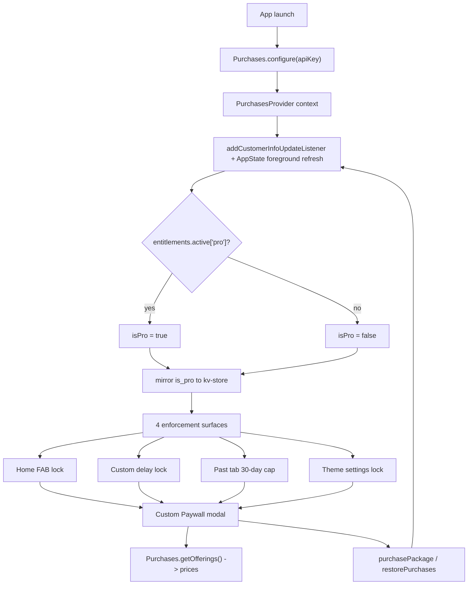

# Wants — Payments Setup (RevenueCat, iOS first)

Last updated: 2026-06-24

Step-by-step guide for integrating RevenueCat into Wants. See [prd.md](prd.md) for product intent (§8 free vs pro, S13 paywall) and [IMPLEMENTATION_STATUS.md](IMPLEMENTATION_STATUS.md) for what is implemented vs deferred.

**Scope:** iOS first. Custom paywall matching PRD S13 (not RevenueCat's prebuilt UI). Android parity is a later pass.

Tick off phases as you complete them across sessions. Phases are ordered so you can stop and resume at any boundary.

**Placeholder first:** Build monetization UI and gates on local `is_pro` before accounts or live purchases — see [PAYMENTS_PLACEHOLDER.md](PAYMENTS_PLACEHOLDER.md).

---

## Key facts (confirmed Jun 2026)

- `react-native-purchases` **^10.4.0** in this repo. Requires React Native `>= 0.73`; repo is on RN `0.83.6` + Expo SDK `55` — compatible.
- Package is **installed** but **not configured** (no config plugin in `app.json`, no `Purchases.configure` in app code).
- **RevenueCat Test Store** works without Apple Developer Program or App Store Connect — free RevenueCat account; `test_` or `rcb_` API key; configure products/entitlements in dashboard. ([Test Store docs](https://www.revenuecat.com/docs/test-and-launch/sandbox/test-store))
- **Expo Go** can exercise Test Store / simulated purchases with a `test_` key (`isExpoGo()` Preview mode). **Native StoreKit sandbox** (`appl_` key) requires a **custom EAS development build**.
- Install / update via `npx expo install react-native-purchases` and register its **Expo config plugin** in `app.json` before native builds.
- v1 is local-only / no accounts (PRD §2). Do **not** pass a custom `appUserID` — omit it or use `null` so RevenueCat generates an anonymous ID. Restore ties to the user's Apple ID on platform stores.
- Entitlement identifier: **`pro`** (PRD §8). Mirror to kv-store key **`is_pro`** — already defined in `src/constants/storage-keys.ts` (`IS_PRO_KEY`). v1 implementation uses kv-store, not a Drizzle settings table.
- Env keys (see `src/lib/env.ts`, `src/env.d.ts`): `EXPO_PUBLIC_REVENUECAT_IOS_KEY`, `EXPO_PUBLIC_REVENUECAT_ANDROID_KEY`. Add `EXPO_PUBLIC_REVENUECAT_TEST_KEY` for Test Store phase.
- **Never ship release builds with a `test_` key** — RevenueCat SDK blocks/crashes production builds configured with Test Store keys.

### API key selection

| Environment | Key prefix | When |
|-------------|------------|------|
| Expo Go, Test Store, web dev | `test_` or `rcb_` | Placeholder + Phase 0a |
| iOS native sandbox / production | `appl_` | Phase 0b+ dev build |
| Android (later) | `goog_` | Android parity pass |

Select via `EXPO_PUBLIC_APP_ENV` / `__DEV__` in `src/lib/purchases.ts` — not hardcoded in components.

---

## Architecture (target — RevenueCat)

**Placeholder architecture** (before this guide's Phase 3): see [PAYMENTS_PLACEHOLDER.md](PAYMENTS_PLACEHOLDER.md).

PRD §8 defines **four** enforcement surfaces (FAB, custom delay, past tab, theme). Placeholder implements three; custom delay is deferred.

---

## Placeholder — local UI & gates (no accounts)

Complete [PAYMENTS_PLACEHOLDER.md](PAYMENTS_PLACEHOLDER.md) before or in parallel with Phase 0a. No RevenueCat or Apple account required for placeholder work.

---

## Phase 0a — RevenueCat Test Store (no Apple account)

**Goal:** simulated purchases and real-shaped entitlements before App Store Connect.

- [ ] **RevenueCat account** (free) at [app.revenuecat.com](https://app.revenuecat.com)
- [ ] **Create Test Store** — Apps and Providers → Test configuration → create Test Store (not only Project Settings API keys)
- [ ] **Entitlement** named exactly **`pro`**
- [ ] **Test products** — monthly (~$3.99) and annual (~$29.99) matching PRD S13 intent
- [ ] **Offering** (e.g. `default`) with packages `$rc_monthly` and `$rc_annual`
- [ ] Copy **Test Store API key** (`test_...`) → `EXPO_PUBLIC_REVENUECAT_TEST_KEY`
- [ ] Wire key selection in `src/lib/purchases.ts`: development / Expo Go → `test_`; never use `test_` in production builds

Test Store purchases update `CustomerInfo` and entitlements in the dashboard. Does not validate real StoreKit behavior.

---

## Phase 0b — Apple & App Store Connect (when purchasing Apple Developer)

Required for real IAP products and StoreKit sandbox — **not** required for placeholder or Test Store.

- [ ] **Apple Developer Program** membership ($99/yr)
- [ ] **App Store Connect**: app record with bundle ID `com.kloobel.wants` (already in `app.json`). Minimum metadata; app does not need submission to configure IAPs.
- [ ] **Agreements, Tax, and Banking**: accept **Paid Apps agreement** — IAPs won't load in sandbox until Active
- [ ] **Expo / EAS account** (`npx expo login`) for development builds
- [ ] **Sandbox test account**: App Store Connect → Users and Access → Sandbox Testers

---

## Phase 1 — Native foundation & dev build

**Goal:** iOS development build containing the native RevenueCat module.

**Partial progress in repo:**

- [x] `bundleIdentifier`: `com.kloobel.wants` in `app.json`
- [x] `react-native-purchases` installed (`^10.4.0`)
- [x] `eas.json` with `development` profile (`developmentClient: true`)

**Still needed:**

- [ ] Add `buildNumber` under `expo.ios` if not set for store builds
- [ ] Register config plugin in `app.json` `plugins`:
  - `"react-native-purchases"` (optional `ios.userTrackingUsageDescription` only if attribution added later)
- [ ] **Build dev client**:
  - Cloud: `eas build --profile development --platform ios`
  - Local: `npx expo run:ios` after prebuild
- [ ] Run `npx expo start --dev-client` for **native StoreKit sandbox** testing (`appl_` key)

Expo Go + `test_` key is enough for Test Store; dev build is required for `appl_` / StoreKit sandbox.

---

## Phase 2 — App Store products & RevenueCat iOS app

- [ ] **App Store Connect → Subscriptions**: Auto-Renewable Subscription group with:
  - Monthly (~$3.99) — e.g. `wants_pro_monthly`
  - Annual (~$29.99) — e.g. `wants_pro_annual`
  - **7-day free trial** on annual (or both) — PRD S13 CTA “Start free 7-day trial”
- [ ] **RevenueCat dashboard**:
  - Add **iOS app**; upload App Store Connect API key / shared secret
  - Products referencing App Store product IDs → `pro` entitlement
  - Offering with `$rc_monthly` and `$rc_annual`
  - Copy **iOS public API key** (`appl_...`) → `EXPO_PUBLIC_REVENUECAT_IOS_KEY`

---

## Phase 3 — App integration: configure + entitlement state

**Replaces** placeholder `ProProvider` from [PAYMENTS_PLACEHOLDER.md](PAYMENTS_PLACEHOLDER.md).

- [x] `IS_PRO_KEY` in `src/constants/storage-keys.ts`
- [ ] **`src/lib/purchases.ts`** — `Purchases.configure` with environment-aware API key; `getCustomerInfo`, `getOfferings`, `purchasePackage`, `restorePurchases`; `isPro(customerInfo)` checking `entitlements.active["pro"]`; `isExpoGo()` guard
- [ ] **`src/contexts/purchases-context.tsx`** (model on `src/contexts/settings-context.tsx`):
  - Configure once on mount
  - Initial `getCustomerInfo()` + `addCustomerInfoUpdateListener`
  - Re-fetch on `AppState` foreground (PRD §8) — pattern from `src/hooks/use-notification-permission.ts`
  - Expose `{ isPro, offerings, loading, purchase(pkg), restore(), refresh() }`
  - Mirror `isPro` to kv-store; seed from kv-store on init to avoid free-tier flash
- [ ] Mount in `src/db/migrations.tsx` inside `AppReadyWithOnboarding`, beside `SettingsProvider`
- [ ] **`useIsPro()`** — thin selector over purchases context

---

## Phase 4 — Paywall: swap placeholder for RevenueCat

Placeholder route and navigation already exist. Replace stub offerings and purchase handlers.

- [x] Route `src/app/paywall.tsx`, modal in `src/app/_layout.tsx`
- [x] `src/lib/push-paywall-route.ts`
- [ ] Full UI per PRD S13 (if not done in placeholder): headline, **four** bullets (includes premium themes), monthly/annual cards
- [ ] Prices from `offerings.current` — localized `priceString` (never hardcoded in production)
- [ ] CTA reflects trial on selected package when present
- [ ] `restorePurchases()`; dismiss on success; handle `PURCHASE_CANCELLED_ERROR` silently
- [ ] Remove or bypass `src/lib/paywall-placeholder-offerings.ts`

---

## Phase 5 — Enforcement gates (PRD §8)

Four surfaces per PRD. Placeholder covers FAB, past tab, and theme; verify and wire to `PurchasesProvider`.

1. **Home FAB + add guard** — `src/app/home.tsx`, `src/app/add-want.tsx` (see PAYMENTS_PLACEHOLDER Phase P4)
2. **Custom delay** — **deferred** (not in placeholder scope). When built:
   - Add Custom to delay picker
   - Non-pro → paywall
   - Pro custom input UX TBD
3. **Past tab 30-day cap** — `src/app/all-wants.tsx`, `src/db/queries/items.ts`
4. **Theme settings** — `src/app/settings/theme.tsx` (done; verify with live entitlement sync)

No other paywalls (project rule).

---

## Phase 6 — Account screen (PRD S12)

- [ ] Flesh out `src/app/settings/account.tsx` if placeholder not complete
- [ ] Swap `restorePlaceholder()` for `restorePurchases()` with result alert

---

## Phase 7 — Testing & verification

| Mode | Build | API key | Validates |
|------|-------|---------|-----------|
| Placeholder | Expo Go | none | UI, gates, kv-store `is_pro` |
| Test Store | Expo Go or dev | `test_` | RC offerings, simulated purchase, entitlements |
| Apple sandbox | Dev client | `appl_` | StoreKit, sandbox tester Apple ID |
| Production | Release | `appl_` only | Never `test_` |

Checklist:

- [ ] Offerings load with localized prices (Test Store or sandbox)
- [ ] Purchase flips `isPro`; all active gates unlock
- [ ] Restore works on fresh install
- [ ] Cancel mid-purchase handled silently
- [ ] `is_pro` persists across cold starts; re-syncs on foreground

---

## Docs to update when implementation is complete

- [ ] [IMPLEMENTATION_STATUS.md](IMPLEMENTATION_STATUS.md): monetization / paywall sections
- [ ] [PAYMENTS_PLACEHOLDER.md](PAYMENTS_PLACEHOLDER.md): mark phases done or archive swap table

---

## Open items

- **Custom delay** — deferred from placeholder; no pro custom input yet; full feature and UX TBD before Phase 5 gate 2
- Align `.cursor/rules/project-context.mdc` enforcement count with PRD §8 (four surfaces) if not already updated

---

## Reference links

- [RevenueCat React Native SDK](https://github.com/RevenueCat/react-native-purchases)
- [RevenueCat Test Store](https://www.revenuecat.com/docs/test-and-launch/sandbox/test-store)
- [Sandbox testing overview](https://www.revenuecat.com/docs/test-and-launch/sandbox)
- [Monetization placeholder checklist](PAYMENTS_PLACEHOLDER.md)
- [Expo development builds](https://docs.expo.dev/develop/development-builds/introduction/)
- [EAS Build](https://docs.expo.dev/build/introduction/)
