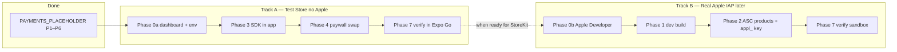
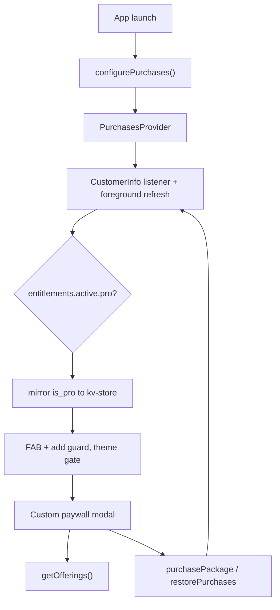

# Wants — Payments Setup (RevenueCat, iOS first)

Last updated: 2026-06-29

Step-by-step guide for integrating RevenueCat into Wants. See [prd.md](prd.md) for product intent (§8 free vs pro, S13 paywall) and [IMPLEMENTATION_STATUS.md](IMPLEMENTATION_STATUS.md) for what is implemented vs deferred.

**Scope:** iOS first. Custom paywall matching PRD S13 (not RevenueCat's prebuilt UI). Android parity is a later pass.

Tick off phases as you complete them across sessions.

---

## Recommended path (read this first)

Two **independent** tracks. You do **not** need Apple (0b) to test purchases in the app.

| Step           | What                        | Apple account?   | App sees purchases in RC dashboard? |
| -------------- | --------------------------- | ---------------- | ----------------------------------- |
| Placeholder    | Local `is_pro`, UI, gates   | No               | No — stub only                      |
| **0a**         | RC Test Store + `test_` key | No               | No until **Phase 3**                |
| **3 + 4**      | Wire SDK + real paywall     | No               | **Yes** (simulated Test Store UI)   |
| **0b + 1 + 2** | Real products + `appl_` key | **Yes** ($99/yr) | Yes (StoreKit sandbox)              |
| Release        | Production `appl_` only     | Yes              | Yes                                 |

**Next step for this repo:** **TestFlight** (optional release-like QA) → **production** build + App Store submit. Track B sandbox verified on **EAS preview** build (Jun 2026).

**Placeholder:** [PAYMENTS_PLACEHOLDER.md](PAYMENTS_PLACEHOLDER.md) — **complete** (local UI, gates, subscription settings).

---

## Current repo status (Jun 2026)

| Item                                                         | Status                                            |
| ------------------------------------------------------------ | ------------------------------------------------- |
| Placeholder `ProProvider`, paywall UI, gates, dev Toggle Pro | Done — `PurchasesProvider` replaces `ProProvider` |
| `react-native-purchases` ^10.4.0 installed                   | Done                                              |
| `src/lib/purchases.ts` (key selection + SDK helpers)         | Done — wired via `PurchasesProvider`              |
| `EXPO_PUBLIC_REVENUECAT_TEST_KEY` in env types               | Done — set in your local `.env`                   |
| `Purchases.configure` on app launch                          | Done (Phase 3)                                    |
| Paywall uses RC offerings + `purchasePackage()`              | Done (Phase 4)                                    |
| `react-native-purchases` config plugin in `app.json`         | N/A — autolinking only (v10.4.0)                  |
| App Store products + RC iOS app + `default` offering         | Done (Phase 2)                                    |
| StoreKit sandbox on physical device                          | Done — EAS **preview** build + sandbox Apple ID   |
| `EXPO_PUBLIC_REVENUECAT_IOS_KEY` in EAS **preview** env      | Done — verified sandbox purchase in RC dashboard  |
| Account settings screen                                      | Removed — subscription hub + subscription screen  |

Paywall prices come from RevenueCat offerings (`src/lib/paywall-offerings.ts`). **Expo Go** uses Test Store (`test_` key); **preview / TestFlight / production** builds use StoreKit (`appl_` key).

**Monetization model (Jun 2026):** Single lifetime unlock — product **`wants_pro_unlock`**, suggested price **$9.99 USD**. No subscriptions. Entitlement **`pro`**. See [Manual migration guide](#manual-migration-guide-lifetime-only) below if updating from the old three-plan catalog.

---

## Manual migration guide (lifetime-only)

Complete these steps **before** testing the updated app against real offerings.

### 1. App Store Connect

1. Open [App Store Connect](https://appstoreconnect.apple.com) → **Apps** → Wants → **Monetization** → **In-App Purchases**.
2. **Old subscriptions** (`wants_pro_monthly`, `wants_pro_annual`): remove from sale or delete (app not live; no legacy support).
3. **Old non-consumable** (`wants_pro_lifetime`): remove if replaced.
4. **Create non-consumable IAP:**
   - Product ID: **`wants_pro_unlock`** (must match `PRO_PRODUCT_ID` in `src/lib/purchases.ts`)
   - Type: **Non-Consumable**
   - Price: **$9.99 USD** (Apple sets localized prices)
   - Display name / description: e.g. "Wants Pro — Lifetime Unlock"
   - Add IAP review screenshot (paywall screen)
5. Submit IAP for review with the app binary.

### 2. RevenueCat dashboard (iOS app)

Per [RevenueCat non-subscriptions docs](https://www.revenuecat.com/docs/platform-resources/non-subscriptions): configure as **non-consumable** so restore works.

1. **Product catalog → Products** — import/link **`wants_pro_unlock`**; set **non-consumable**; detach old products.
2. **Entitlements** — attach **only** `wants_pro_unlock` to **`pro`**.
3. **Offerings → `default`** — remove monthly/annual/old lifetime packages; add **one** lifetime package (`$rc_lifetime` recommended); set as **current** offering.
4. Verify offering preview shows **1 package** (~$9.99 US).

### 3. RevenueCat Test Store (Expo Go)

1. Add **`wants_pro_unlock`** as non-consumable, ~$9.99.
2. Attach to entitlement **`pro`**.
3. Update **`default`** offering to single lifetime package.

### 4. EAS / env

No API key changes. Rebuild preview/production after ASC + RC are updated.

### 5. Verification

| Environment | Build | Pass criteria |
| --- | --- | --- |
| Test Store | Expo Go + `test_` key | 1 package loads; purchase flips `isPro`; restore works |
| StoreKit sandbox | EAS preview + `appl_` key | $9.99; purchase + restore; RC shows `pro` entitlement |

---

## Key facts

- RN `0.83.6` + Expo SDK `55` — compatible with `react-native-purchases` ^10.4.0 (Test Store min RN SDK 9.5.4).
- **Test Store** — free RC account; `test_` or `rcb_` API key; no App Store Connect. ([Test Store docs](https://www.revenuecat.com/docs/test-and-launch/sandbox/test-store))
- **Expo Go** + `test_` key → Test Store simulated purchases. **StoreKit sandbox** (`appl_` key) needs a **native build** (EAS **preview** or **production** — dev client optional).
- v1 local-only (PRD §2): do **not** pass a custom `appUserID` — anonymous RC ID; restore on real stores ties to Apple ID.
- Entitlement identifier: **`pro`**. Product identifier: **`wants_pro_unlock`**. Mirror to kv-store **`is_pro`** (`IS_PRO_KEY`).
- **Never ship release builds with a `test_` key** — blocked/crashes in production.

### API keys

| Key prefix       | Use when                 | Env var                              |
| ---------------- | ------------------------ | ------------------------------------ |
| `test_` / `rcb_` | Expo Go, dev, Test Store | `EXPO_PUBLIC_REVENUECAT_TEST_KEY`    |
| `appl_`          | iOS sandbox / production | `EXPO_PUBLIC_REVENUECAT_IOS_KEY`     |
| `goog_`          | Android (later)          | `EXPO_PUBLIC_REVENUECAT_ANDROID_KEY` |

Selection logic lives in `src/lib/purchases.ts` (`getRevenueCatApiKey`) — not in UI components.

### Dashboard navigation (UI varies)

Older docs say **Apps and providers**. Current dashboard often shows:

- **Apps** → Test Store (or **Project settings → API keys** for `test_` key)
- **Product catalog** → Products, Entitlements, Offerings

---

## Architecture (target)

PRD §8: two enforcement surfaces (FAB/add, theme). Placeholder gates already wired to `useIsPro()` — Phase 5 is verify with live entitlements after Phase 3.

---

## Phase 0a — RevenueCat Test Store (no Apple account)

**Goal:** Catalog + API key ready so Phase 3 can talk to RevenueCat. **Does not connect the app by itself.**

### A. RevenueCat dashboard

- [x] RevenueCat account at [app.revenuecat.com](https://app.revenuecat.com)
- [x] **Test Store** enabled (sidebar **Apps** → Test Store, or auto-created on new project)
- [x] Entitlement named exactly **`pro`**
- [ ] One **Test Store** product: **`wants_pro_unlock`** — non-consumable ~$9.99
- [ ] Product attached to entitlement **`pro`**
- [ ] Offering **`default`** (current) with single lifetime package (`$rc_lifetime`)
- [x] Copy **Test Store public API key** (`test_…`)

### B. Codebase / local env

- [x] `EXPO_PUBLIC_REVENUECAT_TEST_KEY` in `src/env.d.ts`, `src/lib/env.ts`, `.env.example`
- [ ] `EXPO_PUBLIC_REVENUECAT_TEST_KEY=test_…` in your local **`.env`** (not committed)
- [x] `src/lib/purchases.ts` — `getRevenueCatApiKey()`, SDK helpers, production guard against `test_`
- [x] Restart Metro after `.env` changes

### C. Manual verify (0a only)

- [ ] Dashboard: offering shows 1 package with price
- [x] App still launches (SDK not configured yet — expected)

Purchases appear in RC dashboard only after **Phase 3**.

---

## Phase 0b — Apple & App Store Connect (optional until StoreKit)

**Skip until Track B.** Not required for placeholder, Test Store, or Phase 3–4 in Expo Go.

- [x] Apple Developer Program ($99/yr)
- [x] App Store Connect app: bundle ID `com.kloobel.wants` (in `app.json`)
- [x] Agreements, Tax, Banking — **Paid Apps** agreement Active
- [x] Expo / EAS account for dev builds
- [x] Sandbox tester (Users and Access → Sandbox Testers)

---

## Phase 1 — Native foundation & dev build

**Required for `appl_` / StoreKit sandbox.** **Not required** for Expo Go + `test_`.

- [x] `bundleIdentifier`: `com.kloobel.wants`
- [x] `react-native-purchases` installed
- [x] `eas.json` build profiles (`development`, `preview`, `production` with `environment` on preview/production)
- [x] `buildNumber` under `expo.ios`
- [x] Native module via autolinking (`react-native-purchases` in `package.json` — no Expo config plugin in v10.4.0)
- [x] Native iOS build for StoreKit: `eas build --profile preview --platform ios` (verified Jun 2026)
- [ ] Dev client + Metro (`eas build --profile development` + `npx expo start --dev-client`) — optional; not needed for IAP testing if using preview/TestFlight

---

## Phase 2 — App Store products & RevenueCat iOS app

Pairs with Phase 0b. Links real Apple product IDs to RC.

- [x] App Store Connect non-consumable: **`wants_pro_unlock`** (~$9.99 USD)
- [x] RevenueCat: iOS app links **`wants_pro_unlock`** → **`pro`** entitlement
- [x] Offering **`default`**: single lifetime package (`$rc_lifetime`)
- [x] `EXPO_PUBLIC_REVENUECAT_IOS_KEY` (`appl_…`) in EAS **preview** env (verified sandbox purchase)
- [x] `EXPO_PUBLIC_REVENUECAT_IOS_KEY` in EAS **production** env

---

## Phase 3 — App integration: configure + entitlement state

**Replaces** placeholder `ProProvider`. **This is when the app connects to RevenueCat.**

- [x] `IS_PRO_KEY` in storage
- [x] `src/lib/purchases.ts` helpers (see Phase 0a)
- [x] **`src/contexts/purchases-context.tsx`** (model on `settings-context.tsx`):
  - Call `configurePurchases()` once on mount
  - `getCustomerInfo()` + `addCustomerInfoUpdateListener`
  - Re-fetch on `AppState` foreground (PRD §8)
  - Expose `{ isPro, offerings, loading, purchase(pkg), restore(), refresh() }`
  - Mirror `isPro` to kv-store; seed from kv-store on init
- [x] Mount in `src/db/migrations.tsx` beside `SettingsProvider` (replace `ProProvider`)
- [x] **`useIsPro()`** → purchases context
- [x] Keep dev **Toggle Pro** on Home for internal testing (`setDevProOverride`)

After Phase 3: Test Store purchases should appear under **Customers** in RC dashboard.

---

## Phase 4 — Paywall: swap placeholder for RevenueCat

- [x] Route `src/app/paywall.tsx`, modal, `pushPaywallRoute()`
- [x] Paywall shell UI
- [x] Prices from offerings — localized `priceString` via `src/lib/paywall-offerings.ts`
- [x] CTA → `purchasePackage(selectedPackage)`; dismiss only on success
- [x] Subscription screen: `restore()` (placeholder aliases removed)
- [x] Handle `PURCHASE_CANCELLED_ERROR` silently (`purchase()` returns `false`)
- [x] `paywall-placeholder-offerings.ts` — static copy only (no hardcoded prices)

---

## Phase 5 — Enforcement gates (verify live entitlements)

Gates already implemented in placeholder — **re-verify** with a real sandbox purchase (dev toggle **off**):

1. **Home FAB + add guard** — `home.tsx`, `add-want.tsx`
2. **Theme settings** — `theme.tsx`

No other paywalls.

- [x] Sandbox purchase unlocks FAB / add (verified on preview build, Jun 2026)
- [ ] Premium theme gate re-verified after sandbox purchase (quick manual pass)

---

## Phase 6 — Subscription settings (PRD S12)

- [x] Settings hub: Subscription row with plan label (Free / Pro)
- [x] Subscription screen: status, upgrade, restore
- [x] Swap remaining `restorePlaceholder` / `purchasePlaceholder` references after Phase 3–4

- Account screen removed — subscription is the monetization entry point

---

## Phase 7 — Testing & verification

| Mode           | Build      | API key      | What it proves                                       |
| -------------- | ---------- | ------------ | ---------------------------------------------------- |
| Placeholder    | Expo Go    | none         | UI, gates, local `is_pro`                            |
| **Test Store** | Expo Go    | `test_`      | RC offerings, simulated purchase, dashboard customer |
| Apple sandbox  | EAS **preview** or dev client | `appl_` (EAS preview env) | Real StoreKit, sandbox Apple ID — **verified Jun 2026** |
| TestFlight     | EAS **production**            | `appl_` (EAS production env) | Release-like; same sandbox Apple ID flow — **verified Jun 2026** |
| Production     | App Store release             | `appl_` only              | Never `test_`                                         |

**Checklist — Test Store (Expo Go + `test_`):**

- [x] Offerings load with localized prices
- [x] Purchase flips `isPro`; gates unlock
- [x] Customer + `pro` entitlement in RC dashboard
- [x] Restore works
- [x] Cancel mid-purchase — no error spam
- [x] `is_pro` persists; re-syncs on foreground
- [x] Dev Toggle Pro still flips local state for quick QA

**Checklist — StoreKit sandbox (preview build + sandbox Apple ID):**

- [x] Offerings load with Apple prices
- [x] Sandbox purchase completes; `pro` in RC dashboard
- [x] Revenue appears in RC (sandbox transaction)
- [ ] Restore after reinstall
- [ ] Cancel mid-purchase — no error spam
- [ ] `is_pro` persists after kill + reopen

---

## EAS environment variables (reference)

Set in [expo.dev](https://expo.dev) → project → **Environment variables**. Build profiles in `eas.json` map via `"environment"`.

| EAS environment | `EXPO_PUBLIC_APP_ENV` | RevenueCat keys |
| --- | --- | --- |
| **development** | `development` | `test_` (+ optional `appl_` for local dev client) |
| **preview** | `preview` | `appl_` only — **verified** |
| **production** | `production` | `appl_` only — **verified** (TestFlight Jun 2026) |

Local `.env` is for Expo Go / Metro only; EAS builds bake vars at compile time.

---

## Docs to update when RevenueCat integration is complete

- [x] [IMPLEMENTATION_STATUS.md](IMPLEMENTATION_STATUS.md)
- [x] [PAYMENTS_PLACEHOLDER.md](PAYMENTS_PLACEHOLDER.md) — marked swap complete

---

## Open items (pre-release)

- [ ] App Store Connect metadata — see [IMPLEMENTATION_STATUS.md § App Store Connect metadata](IMPLEMENTATION_STATUS.md#app-store-connect-metadata)
- [ ] Hosted legal pages — contact email + jurisdiction placeholders in `docs/legal/`
- [ ] IAP review screenshot on ASC for `wants_pro_unlock`
- [ ] App Store submit
- [ ] Phase 5: premium theme gate quick re-verify after sandbox purchase (optional if TestFlight covered)
- [ ] Phase 7 sandbox: restore after reinstall, persist checks (optional)

---

## Reference links

- [RevenueCat React Native SDK](https://github.com/RevenueCat/react-native-purchases)
- [RevenueCat Test Store](https://www.revenuecat.com/docs/test-and-launch/sandbox/test-store)
- [Connect a store](https://www.revenuecat.com/docs/projects/connect-a-store)
- [Monetization placeholder checklist](PAYMENTS_PLACEHOLDER.md)
- [Expo development builds](https://docs.expo.dev/develop/development-builds/introduction/)
- [EAS Build](https://docs.expo.dev/build/introduction/)

