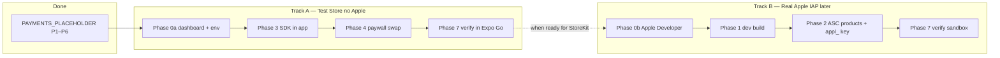
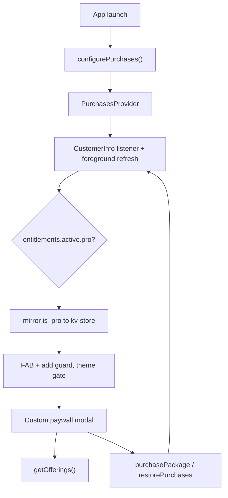

# Wants — Payments Setup (RevenueCat, iOS first)

Last updated: 2026-06-24

Step-by-step guide for integrating RevenueCat into Wants. See [prd.md](prd.md) for product intent (§8 free vs pro, S13 paywall) and [IMPLEMENTATION_STATUS.md](IMPLEMENTATION_STATUS.md) for what is implemented vs deferred.

**Scope:** iOS first. Custom paywall matching PRD S13 (not RevenueCat's prebuilt UI). Android parity is a later pass.

Tick off phases as you complete them across sessions.

---

## Recommended path (read this first)

Two **independent** tracks. You do **not** need Apple (0b) to test purchases in the app.

| Step           | What                        | Apple account?   | App sees purchases in RC dashboard? |
| -------------- | --------------------------- | ---------------- | ----------------------------------- |
| Placeholder    | Local `is_pro`, UI, gates   | No               | No — stub only                      |
| **0a**         | RC Test Store + `test_` key | No               | No until **Phase 3**                |
| **3 + 4**      | Wire SDK + real paywall     | No               | **Yes** (simulated Test Store UI)   |
| **0b + 1 + 2** | Real products + `appl_` key | **Yes** ($99/yr) | Yes (StoreKit sandbox)              |
| Release        | Production `appl_` only     | Yes              | Yes                                 |

**Next step for this repo:** **Phase 5** (verify gates with live entitlements) → **Phase 7** Test Store checklist in Expo Go. Skip **0b** until you want real StoreKit / App Store products.

**Placeholder:** [PAYMENTS_PLACEHOLDER.md](PAYMENTS_PLACEHOLDER.md) — **complete** (local UI, gates, subscription settings).

---

## Current repo status (Jun 2026)

| Item                                                         | Status                                            |
| ------------------------------------------------------------ | ------------------------------------------------- |
| Placeholder `ProProvider`, paywall UI, gates, dev Toggle Pro | Done — `PurchasesProvider` replaces `ProProvider` |
| `react-native-purchases` ^10.4.0 installed                   | Done                                              |
| `src/lib/purchases.ts` (key selection + SDK helpers)         | Done — wired via `PurchasesProvider`              |
| `EXPO_PUBLIC_REVENUECAT_TEST_KEY` in env types               | Done — set in your local `.env`                   |
| `Purchases.configure` on app launch                          | Done (Phase 3)                                    |
| Paywall uses RC offerings + `purchasePackage()`              | Done (Phase 4)                                    |
| `react-native-purchases` config plugin in `app.json`         | Not done (Phase 1)                                |
| Account settings screen                                      | Removed — subscription hub + subscription screen  |

Paywall prices come from RevenueCat offerings (`src/lib/paywall-offerings.ts`); purchase/restore go through RevenueCat (Test Store in Expo Go).

---

## Key facts

- RN `0.83.6` + Expo SDK `55` — compatible with `react-native-purchases` ^10.4.0 (Test Store min RN SDK 9.5.4).
- **Test Store** — free RC account; `test_` or `rcb_` API key; no App Store Connect. ([Test Store docs](https://www.revenuecat.com/docs/test-and-launch/sandbox/test-store))
- **Expo Go** + `test_` key → Test Store simulated purchases. **StoreKit sandbox** (`appl_` key) needs a **custom dev build** (Phase 1).
- v1 local-only (PRD §2): do **not** pass a custom `appUserID` — anonymous RC ID; restore on real stores ties to Apple ID.
- Entitlement identifier: **`pro`**. Mirror to kv-store **`is_pro`** (`IS_PRO_KEY`).
- **Never ship release builds with a `test_` key** — blocked/crashes in production.

### API keys

| Key prefix       | Use when                 | Env var                              |
| ---------------- | ------------------------ | ------------------------------------ |
| `test_` / `rcb_` | Expo Go, dev, Test Store | `EXPO_PUBLIC_REVENUECAT_TEST_KEY`    |
| `appl_`          | iOS sandbox / production | `EXPO_PUBLIC_REVENUECAT_IOS_KEY`     |
| `goog_`          | Android (later)          | `EXPO_PUBLIC_REVENUECAT_ANDROID_KEY` |

Selection logic lives in `src/lib/purchases.ts` (`getRevenueCatApiKey`) — not in UI components.

### Dashboard navigation (UI varies)

Older docs say **Apps and providers**. Current dashboard often shows:

- **Apps** → Test Store (or **Project settings → API keys** for `test_` key)
- **Product catalog** → Products, Entitlements, Offerings

---

## Architecture (target)

PRD §8: two enforcement surfaces (FAB/add, theme). Placeholder gates already wired to `useIsPro()` — Phase 5 is verify with live entitlements after Phase 3.

---

## Phase 0a — RevenueCat Test Store (no Apple account)

**Goal:** Catalog + API key ready so Phase 3 can talk to RevenueCat. **Does not connect the app by itself.**

### A. RevenueCat dashboard

- [x] RevenueCat account at [app.revenuecat.com](https://app.revenuecat.com)
- [x] **Test Store** enabled (sidebar **Apps** → Test Store, or auto-created on new project)
- [ ] Entitlement named exactly **`pro`**
- [x] Three **Test Store** products (suggested IDs for later Apple parity):
  - `wants_pro_monthly` — subscription ~$1.99/mo
  - `wants_pro_annual` — subscription ~$9.99/yr
  - `wants_pro_lifetime` — one-time ~$19.99
- [ ] All three products attached to entitlement **`pro`**
- [ ] Offering **`default`** (current) with packages `$rc_monthly`, `$rc_annual`, `$rc_lifetime`
- [x] Copy **Test Store public API key** (`test_…`)

### B. Codebase / local env

- [x] `EXPO_PUBLIC_REVENUECAT_TEST_KEY` in `src/env.d.ts`, `src/lib/env.ts`, `.env.example`
- [ ] `EXPO_PUBLIC_REVENUECAT_TEST_KEY=test_…` in your local **`.env`** (not committed)
- [x] `src/lib/purchases.ts` — `getRevenueCatApiKey()`, SDK helpers, production guard against `test_`
- [x] Restart Metro after `.env` changes

### C. Manual verify (0a only)

- [x] Dashboard: offering shows 3 packages with prices
- [x] App still launches (SDK not configured yet — expected)

Purchases appear in RC dashboard only after **Phase 3**.

---

## Phase 0b — Apple & App Store Connect (optional until StoreKit)

**Skip until Track B.** Not required for placeholder, Test Store, or Phase 3–4 in Expo Go.

- [x] Apple Developer Program ($99/yr)
- [x] App Store Connect app: bundle ID `com.kloobel.wants` (in `app.json`)
- [x] Agreements, Tax, Banking — **Paid Apps** agreement Active
- [x] Expo / EAS account for dev builds
- [ ] Sandbox tester (Users and Access → Sandbox Testers)

---

## Phase 1 — Native foundation & dev build

**Required for `appl_` / StoreKit sandbox.** **Not required** for Expo Go + `test_`.

**Partial progress:**

- [x] `bundleIdentifier`: `com.kloobel.wants`
- [x] `react-native-purchases` installed
- [x] `eas.json` development profile

**Still needed:**

- [x] `buildNumber` under `expo.ios` if missing
- [ ] Config plugin in `app.json`: `"react-native-purchases"`
- [x] Dev client: `eas build --profile development --platform ios` or `npx expo run:ios`
- [ ] `npx expo start --dev-client`

---

## Phase 2 — App Store products & RevenueCat iOS app

Pairs with Phase 0b. Links real Apple product IDs to RC.

- [ ] App Store Connect subscriptions: `wants_pro_monthly`, `wants_pro_annual`
- [ ] App Store Connect non-consumable: `wants_pro_lifetime`
- [ ] RevenueCat: add **iOS app**, link products → **`pro`** entitlement
- [ ] Offering packages `$rc_monthly`, `$rc_annual`, `$rc_lifetime`
- [ ] `EXPO_PUBLIC_REVENUECAT_IOS_KEY` (`appl_…`)

---

## Phase 3 — App integration: configure + entitlement state

**Replaces** placeholder `ProProvider`. **This is when the app connects to RevenueCat.**

- [x] `IS_PRO_KEY` in storage
- [x] `src/lib/purchases.ts` helpers (see Phase 0a)
- [x] **`src/contexts/purchases-context.tsx`** (model on `settings-context.tsx`):
  - Call `configurePurchases()` once on mount
  - `getCustomerInfo()` + `addCustomerInfoUpdateListener`
  - Re-fetch on `AppState` foreground (PRD §8)
  - Expose `{ isPro, proPlan, offerings, loading, purchase(pkg), restore(), refresh() }`
  - Mirror `isPro` to kv-store; seed from kv-store on init
- [x] Mount in `src/db/migrations.tsx` beside `SettingsProvider` (replace `ProProvider`)
- [x] **`useIsPro()`** → purchases context
- [x] Keep dev **Toggle Pro** on Home for internal testing (`setDevProOverride`)

After Phase 3: Test Store purchases should appear under **Customers** in RC dashboard.

---

## Phase 4 — Paywall: swap placeholder for RevenueCat

- [x] Route `src/app/paywall.tsx`, modal, `pushPaywallRoute()`
- [x] Paywall shell UI
- [x] Prices from offerings — localized `priceString` via `src/lib/paywall-offerings.ts`
- [x] CTA → `purchasePackage(selectedPackage)`; dismiss only on success
- [x] Subscription screen: `restore()` (placeholder aliases removed)
- [x] Handle `PURCHASE_CANCELLED_ERROR` silently (`purchase()` returns `false`)
- [x] `paywall-placeholder-offerings.ts` — static copy only (no hardcoded prices)

---

## Phase 5 — Enforcement gates (verify live entitlements)

Gates already implemented in placeholder — **re-verify** after Phase 3:

1. **Home FAB + add guard** — `home.tsx`, `add-want.tsx`
2. **Theme settings** — `theme.tsx`

No other paywalls.

---

## Phase 6 — Subscription settings (PRD S12)

- [x] Settings hub: Subscription row with plan label
- [x] Subscription screen: status, upgrade, manage (stub), restore
- [x] Swap remaining `restorePlaceholder` / `purchasePlaceholder` references after Phase 3–4

- Account screen removed — subscription is the monetization entry point

---

## Phase 7 — Testing & verification

| Mode           | Build      | API key      | What it proves                                       |
| -------------- | ---------- | ------------ | ---------------------------------------------------- |
| Placeholder    | Expo Go    | none         | UI, gates, local `is_pro`                            |
| **Test Store** | Expo Go    | `test_`      | RC offerings, simulated purchase, dashboard customer |
| Apple sandbox  | Dev client | `appl_`      | Real StoreKit, sandbox Apple ID                      |
| Production     | Release    | `appl_` only | Never `test_`                                        |

**Checklist (run after Phase 3–4):**

- [x] Offerings load with localized prices
- [x] Purchase flips `isPro`; gates unlock
- [x] Customer + `pro` entitlement in RC dashboard
- [x] Restore works
- [x] Cancel mid-purchase — no error spam
- [x] `is_pro` persists; re-syncs on foreground
- [x] Dev Toggle Pro still flips local state for quick QA

---

## Docs to update when RevenueCat integration is complete

- [ ] [IMPLEMENTATION_STATUS.md](IMPLEMENTATION_STATUS.md)
- [ ] [PAYMENTS_PLACEHOLDER.md](PAYMENTS_PLACEHOLDER.md) — archive or mark swap complete

---

## Open items

- None

---

## Reference links

- [RevenueCat React Native SDK](https://github.com/RevenueCat/react-native-purchases)
- [RevenueCat Test Store](https://www.revenuecat.com/docs/test-and-launch/sandbox/test-store)
- [Connect a store](https://www.revenuecat.com/docs/projects/connect-a-store)
- [Monetization placeholder checklist](PAYMENTS_PLACEHOLDER.md)
- [Expo development builds](https://docs.expo.dev/develop/development-builds/introduction/)
- [EAS Build](https://docs.expo.dev/build/introduction/)

