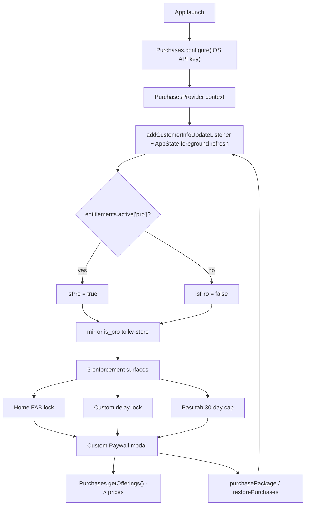

# Wants — Payments Setup (RevenueCat, iOS first)

Last updated: 2026-06-08

Step-by-step guide for integrating RevenueCat into Wants. See [prd.md](prd.md) for product intent (§8 free vs pro, S13 paywall) and [IMPLEMENTATION_STATUS.md](IMPLEMENTATION_STATUS.md) for what is implemented vs deferred.

**Scope:** iOS first. Custom paywall matching PRD S13 (not RevenueCat's prebuilt UI). Android parity is a later pass.

Tick off phases as you complete them across sessions. Phases are ordered so you can stop and resume at any boundary.

---

## Key facts (confirmed Jun 2026)

- Latest `react-native-purchases` is **10.2.2** (published Jun 4 2026). Requires React Native `>= 0.73`; this repo is on RN `0.83.6` + Expo SDK `55` — compatible.
- RevenueCat needs **native code**, so it cannot run real purchases in **Expo Go**. In Expo Go it auto-runs **Preview API Mode** (JS mocks) so the app still loads, but **all real testing requires a custom EAS development build**.
- Install via `npx expo install react-native-purchases` and register its **Expo config plugin** in `app.json`.
- v1 is local-only / no accounts (PRD §2), so use RevenueCat **anonymous app user IDs** (never pass `appUserID`). Restore works via the user's Apple ID.
- Entitlement identifier is **`pro`** (PRD §8). Settings key `is_pro` (PRD §3) is **not yet** in the codebase.

---

## Architecture

---

## Phase 0 — Accounts & prerequisites (manual, do first)

- [ ] **Apple Developer Program** membership ($99/yr) — required to create IAP products and use sandbox testing.
- [ ] **App Store Connect**: create the app record (needs a unique bundle ID, e.g. `com.<you>.wants`). Fill in the minimum metadata; the app does **not** need to be submitted to configure IAPs.
- [ ] **App Store Connect → Agreements, Tax, and Banking**: accept the **Paid Apps agreement**. In-app purchases will not load in sandbox until this is "Active".
- [ ] **RevenueCat account** (free) at [app.revenuecat.com](https://app.revenuecat.com).
- [ ] **Expo / EAS account** (`npx expo login`) for development builds. A Mac with Xcode is the simplest path for an iOS dev build; otherwise iOS builds run on EAS cloud.
- [ ] **Sandbox test account**: App Store Connect → Users and Access → Sandbox Testers — create one to test purchases without real charges.

---

## Phase 1 — Native foundation & dev build (config + manual)

**Goal:** get a working iOS development build that contains the native RevenueCat module.

- [ ] Add iOS identity to `app.json`: under `expo.ios` add `bundleIdentifier` (matching App Store Connect) and a `buildNumber`. Set `expo.version` for store display.
- [ ] Install SDK: `npx expo install react-native-purchases` (`react-native-purchases-ui` is **not** needed for the custom paywall).
- [ ] Register the config plugin in `app.json` `plugins`:
  - `"react-native-purchases"` (optionally with `ios.userTrackingUsageDescription` if attribution is added later — not required for v1).
- [ ] Add **EAS config**: run `eas build:configure` to create `eas.json` with a `development` profile (`developmentClient: true`, `distribution: internal`).
- [ ] **Build the dev client**:
  - Cloud: `eas build --profile development --platform ios` then install via the QR/registered device, or
  - Local (Mac + Xcode): `npx expo run:ios` after prebuild.
  - Register your test device UDID when prompted (EAS handles provisioning).
- [ ] From now on, run `npx expo start --dev-client` instead of plain Expo Go for any payment testing.

**Manual notes:** the first iOS dev build will prompt EAS to create/managed signing credentials — accept the defaults unless you have existing certs.

---

## Phase 2 — Store products & RevenueCat dashboard (manual)

- [ ] **App Store Connect → In-App Purchases / Subscriptions**: create an **Auto-Renewable Subscription group** with two products matching PRD S13:
  - Monthly (~$3.99) — e.g. product ID `wants_pro_monthly`.
  - Annual (~$29.99) — e.g. product ID `wants_pro_annual`.
  - Add a **7-day free trial** introductory offer (PRD S13 CTA "Start free 7-day trial"). Recommend adding it to the annual (or both).
- [ ] **RevenueCat dashboard**:
  - Create a Project; add an **iOS app**, upload the **App Store Connect API key / shared secret** so RevenueCat can validate receipts.
  - Create an **Entitlement** named exactly **`pro`**.
  - Create **Products** referencing the two App Store product IDs and attach them to the `pro` entitlement.
  - Create an **Offering** (e.g. `default`) with two **Packages**: `$rc_monthly` and `$rc_annual`.
  - Copy the **iOS public API key** (`appl_...`) — used by the app in Phase 3.
- [ ] Store the iOS API key in app config (not hardcoded in components): add to `app.json` `expo.extra` (read via `expo-constants`) or an env-driven `extra` value. This is a *public* SDK key, safe to ship, but keep it in one place.

---

## Phase 3 — App integration: configure + entitlement state

**Files to add/change:**

- [ ] **Storage key**: add `IS_PRO_KEY = "is_pro"` to `src/constants/storage-keys.ts`.
- [ ] **Purchases service** `src/lib/purchases.ts`: wrapper around `Purchases.configure` (iOS key), `getCustomerInfo`, `getOfferings`, `purchasePackage`, `restorePurchases`, plus an `isPro(customerInfo)` helper checking `entitlements.active["pro"]`. Guard for `isExpoGo()` so dev-in-Expo-Go degrades gracefully.
- [ ] **PurchasesProvider** `src/contexts/purchases-context.tsx` (modeled on `src/contexts/settings-context.tsx`):
  - `configure` once on mount.
  - Initial `getCustomerInfo()` + `addCustomerInfoUpdateListener` (per RevenueCat React Native integration pattern).
  - Re-fetch on `AppState` foreground (PRD §8 "synced on app foreground") — reuse the foreground pattern from `src/hooks/use-notification-permission.ts`.
  - Expose `{ isPro, offerings, loading, purchase(pkg), restore(), refresh() }`.
  - **Mirror `isPro` to kv-store** (`is_pro`) so gates have a synchronous, offline-safe read and to satisfy PRD §3.
  - Seed initial `isPro` synchronously from the kv-store mirror to avoid a free-tier flash on cold start.
- [ ] **Mount** the provider in `src/db/migrations.tsx` inside `AppReadyWithOnboarding`, wrapping (or beside) `SettingsProvider`, so it's active app-wide after migrations.
- [ ] **Hook** `useIsPro()` for components (thin selector over the context).

---

## Phase 4 — Custom Paywall screen (PRD S13)

- [ ] New route `src/app/paywall.tsx`, registered as a `presentation: "modal"` screen in `src/app/_layout.tsx` (alongside `settings`, `add-want`).
- [ ] New helper `src/lib/push-paywall-route.ts` (mirrors `src/lib/push-want-route.ts`).
- [ ] UI per PRD S13, using existing primitives (`Button`, `Text`, theme):
  - Headline "Unlock the full Wants experience"; 3 bullets (unlimited items, custom delays, full history).
  - Two pricing options rendered from `offerings.current` packages — **prices read dynamically** from each package's localized `priceString` (never hardcoded). Highlight annual; compute the "save X%" from monthly vs annual package prices.
  - Primary CTA reflects the annual package's intro/trial ("Start free 7-day trial" when a trial is present on the selected package).
  - "Restore purchase" → `restorePurchases()`; "Maybe later" → dismiss.
  - On successful purchase/restore, the customer-info listener flips `isPro`; close the modal when `entitlements.active["pro"]` is present. Handle `PURCHASE_CANCELLED_ERROR` silently.

---

## Phase 5 — Three enforcement surfaces (exactly these, PRD §8)

No other paywalls anywhere (project rule).

1. **Home FAB gate** — `src/app/home.tsx`
   - [ ] When `!isPro` and `waitingItems.length >= 1`, the FAB shows a lock icon and opens the paywall instead of `/add-want`.
   - [ ] Also guard `src/app/add-want.tsx` on mount so the route can't be entered while gated.

2. **Custom delay lock** — partly net-new (option does not exist yet)
   - [ ] Add a `Custom` entry to the delay options in `src/lib/forms/item-form-schema.ts` / `src/components/wants/item-form-fields.tsx`.
   - [ ] Non-pro: selecting `Custom` opens the paywall (no custom value applied).
   - [ ] Pro: reveal a custom delay input (hours/days). **Confirm UX before building** (slider vs numeric vs day picker) — see Open items below.

3. **Past tab 30-day cap** — `src/app/all-wants.tsx` + `src/db/queries/items.ts`
   - [ ] Add a date-filtered variant of `selectPastItems` (or filter client-side) so non-pro sees only the last 30 days.
   - [ ] Show an "Unlock full history" prompt row that opens the paywall.
   - [ ] Pro sees all-time history.

---

## Phase 6 — Settings Account screen (PRD S12)

- [ ] Flesh out `src/app/settings/account.tsx`:
  - If `!isPro`: show "Upgrade to Pro" → paywall.
  - If `isPro`: show subscription status.
  - Always: "Restore purchases" → `restorePurchases()` with a result alert.

---

## Phase 7 — Testing & verification

- [ ] Run on the **dev build** (`npx expo start --dev-client`), signed into the **sandbox tester** Apple ID on the device.
- [ ] Verify: offerings load with localized prices; purchase monthly/annual flips `isPro`; all three gates unlock; restore works on a fresh install; cancel mid-purchase is handled.
- [ ] Confirm `is_pro` persists across cold starts (kv-store mirror) and re-syncs on foreground.

---

## Docs to update when implementation is complete

- [ ] [IMPLEMENTATION_STATUS.md](IMPLEMENTATION_STATUS.md): move Monetization / Paywall (PRD §8/S13) from "Not started" to done, and the related "Not done" follow-ups under Add / Home / All Wants / Edit / Settings.

---

## Open items

- **Custom-delay input UX** for pro users (the picker currently only supports preset hours). Confirm before Phase 5: slider vs numeric input vs day picker.

---

## Reference links

- [RevenueCat React Native SDK](https://github.com/RevenueCat/react-native-purchases)
- [Expo development builds](https://docs.expo.dev/develop/development-builds/introduction/)
- [EAS Build](https://docs.expo.dev/build/introduction/)
